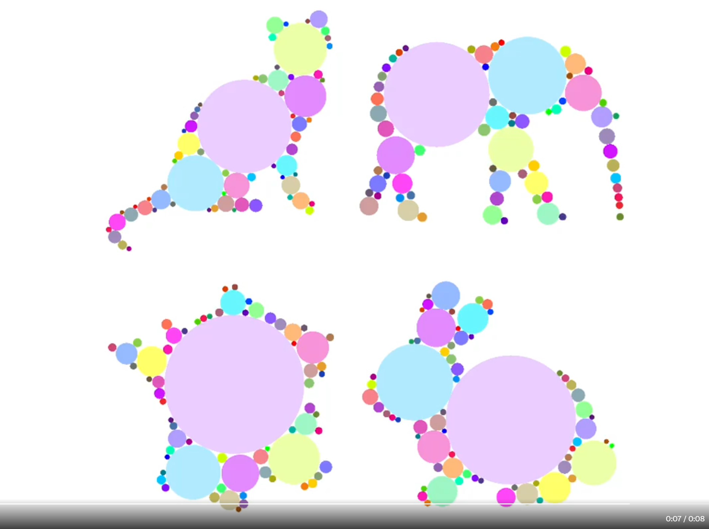
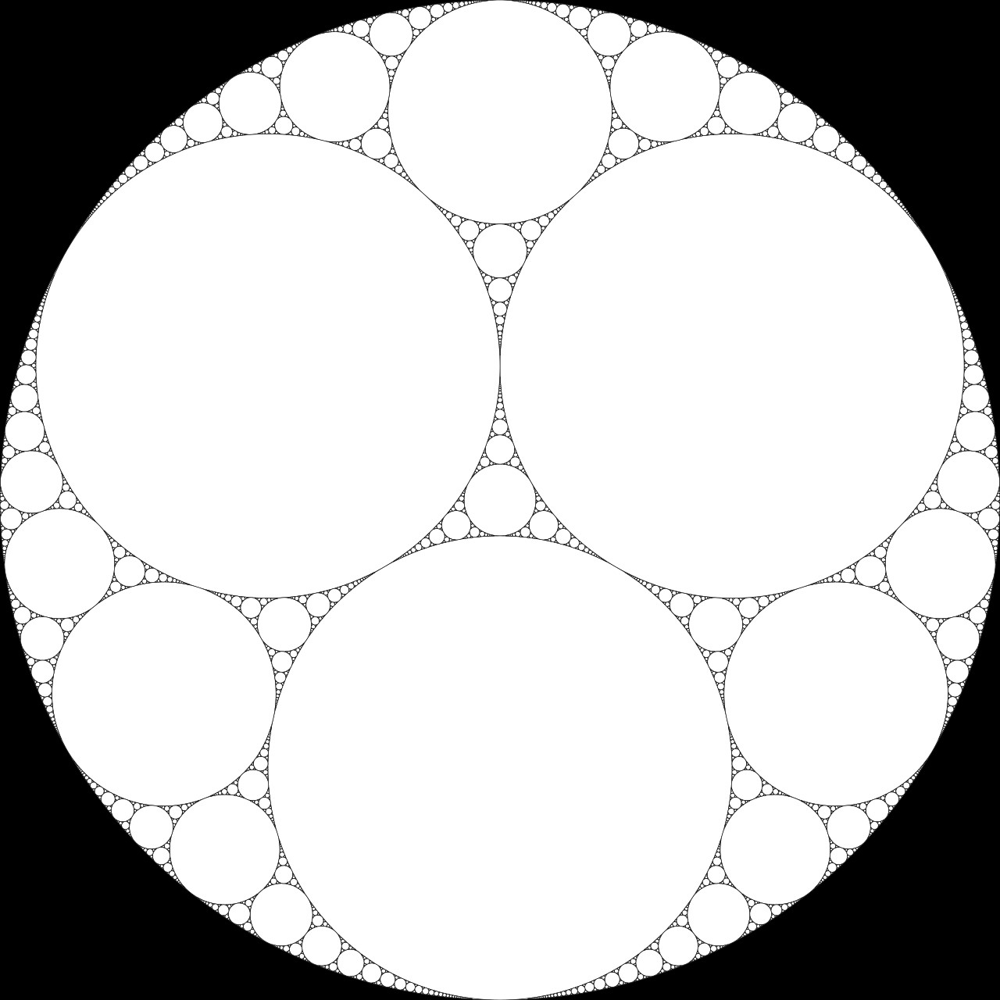
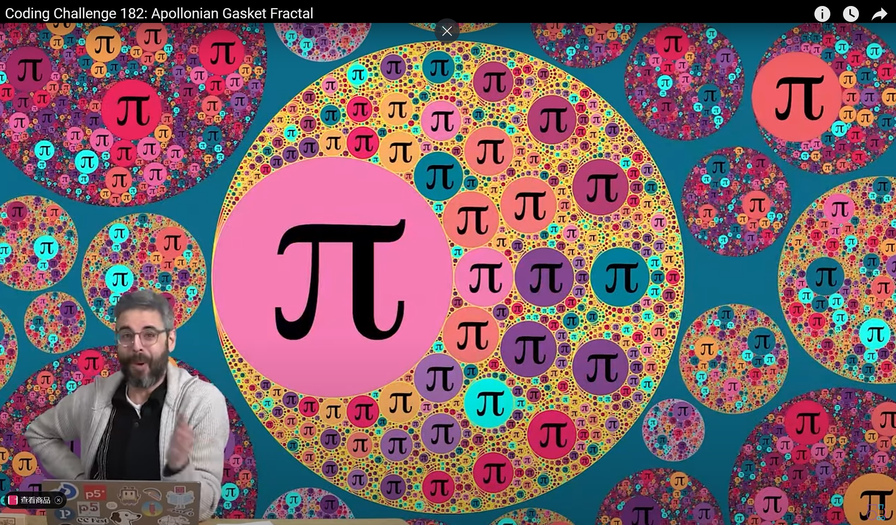

# Qiyue-week-8-Research
# Technique Inspiration
# **HeaderInspiration for what?**

Gabriel Peyré

My inspiration was Gabriel Peyré's code techniques on looping and control. The main core of our study was also to apply the looping and typing code we were learning to the actual output. Peyré's approach, with its core concept of using looping monograms to form composite animal images, provides a structured approach to manipulating visual elements that fit perfectly with my aesthetic vision for the project.

  # Links
  [What is Designer](https://twitter.com/gabrielpeyre/status/1778286858679824502?s=46&t=RakBUvC-eDnA_TrTk1pSVA)

# Design work
custom


# Theory
custom


 # Links
 [Class](https://www.youtube.com/watch?v=6UlGLB_jiCs)


# **Code use**

Combine recursion and object programming to create the Sherbinski Triangle class that generates different branches with random numbers. Recursive methods are called in a loop to continuously refine the pattern and form a complex fractal structure. Enhance the visual effect with a gradient colour background to make the fractal pattern vivid and stand out on the canvas.


# Code Blocks
backtick:
`print(circle loop)`

```
let gaskets = [];
let seed;

let col1, col2;

function setup() {
  createCanvas(800, 800);
  col1 = color(112, 50, 126);
  col2 = color(45, 197, 244);

  seed = int(random(100000));
  console.log(seed);

  gaskets.push(new Gasket(400, 400, 400, color(0), seed));
  for (let n = 0; n < 2; n++) {
    for (let i = gaskets.length - 1; i >= 0; i--) {
      let nextG = gaskets[i].recurse();
      if (nextG) gaskets.push(...nextG);
    }
  }
}

function draw() {
  background(lerpColor(col1, color("black"), 0.5));
  for (let gasket of gaskets) {
    gasket.show();
  }
}

```

 # Links
  [What is code from](https://editor.p5js.org/codingtrain/sketches/leBpmVwaM)
